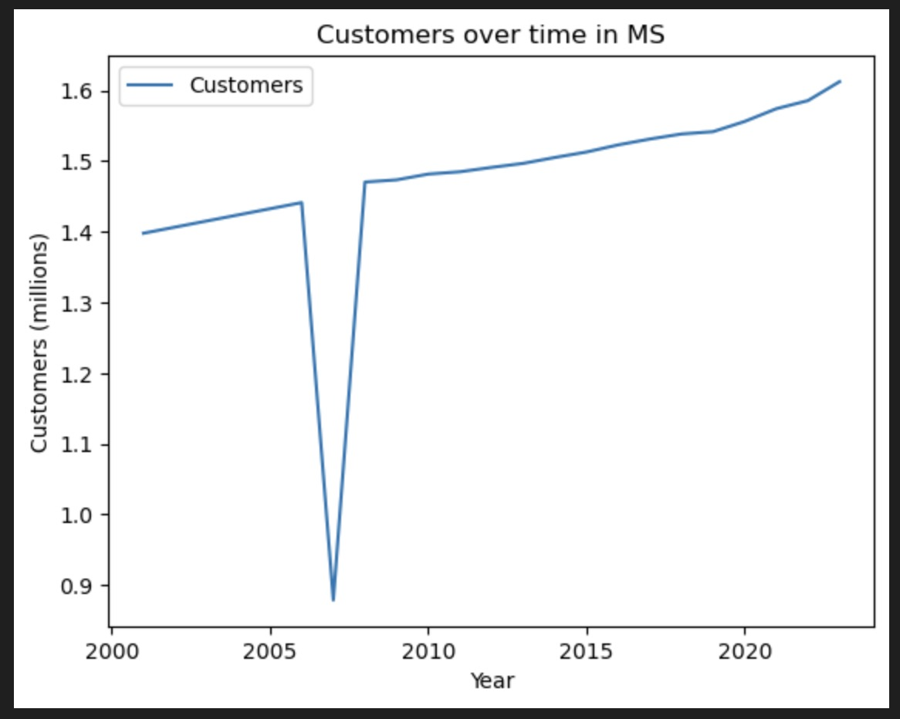
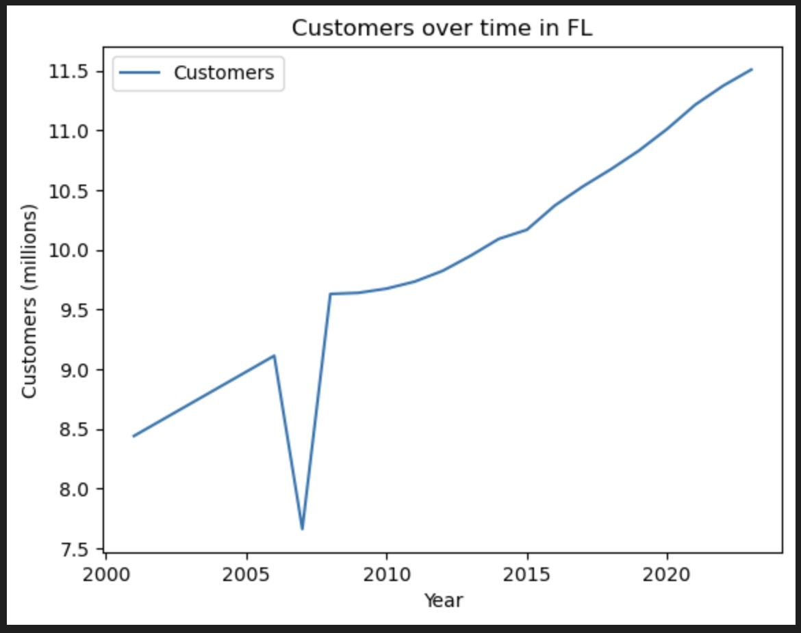

- M. Beekenkamp

# Forecasting the regional impact of energy investments on the cost of electricity.

## Introduction

As the demand for sustainable energy solutions increases, it becomes essential to understand the regional economic implications of clean energy investments due to the non-transferable nature of clean electricity production. Integral to Biden's Inflation Reduction Act are tax credits for clean energy investments, but what will their impact be? Through the use of historical investment data this project aims to predict the specific impact on electricity bills of current clean energy investments on regional economies through the Inflation Reduction Act.

The aim of this project is develop a tool highlighting the potential impact of energy investments on electrical prices in a specific region. This tool is intended to be useful for policy makers, investors, and energy companies looking to understand the potential impact of their investments and if it makes financial sense.

Currently the program is designed to focus on the Southeastern United States, (Kentucky, Tennessee, Alabama, Mississippi, Georgia, South Carolina, North Carolina, and Florida). This was a choice to limit the scope of the project, and the majority of clean energy investments are currently concentrated in this region. It would be trivial to expand the scope of the project to include other regions, but at this stage I've chosen to focus on the Southeast and leave that for another time.

## Use Guide

This code was written in Python 3.11.4, and uses the following packages:

- tensorflow
- numpy
- scipy
- pandas
- matplotlib
- scikit-learn

>[!TIP]
>If you don't have these packages installed, refer to the **installation guide below** for a bash script that will install all of these packages.

<details>
<summary>Installation Guide</summary>

### Installation

To install the required packages, you will need Python 3.8–3.11 and pip version >19.0 (or >20.3 for macOS) installed. For mac users on Apple Silicon, you will also need to install the `tensorflow-macos` package so that the code can run on GPU.

To check if you have a compatible version of Python installed, run the following command in the terminal:

```bash
python --version
```

And to update pip, run the following command in the terminal:

```bash
pip install --upgrade pip
```

Then to install packages, run the following bash script:

```bash
chmod +x install_packages.sh
./install_packages.sh
```

</details>

### Running the code

To run the code, you have two options. If this is your first time running the code, you will need to build the model. This can be done by running the following command in the terminal:

```bash
python main.py
```

However, if you have already built the model, and you want to load your model, you can simply run the following command in the terminal:

```bash
python main.py --load
```

To expand the program to include more states, or to adjust the hyperparameters of the model, you can edit the [`main.py`](Code/main.py) file. More extensive changes to the data or model will require changes to the [`preprocessing.py`](Code/preprocessing.py) and [`model_run.py`](Code/model_run.py) files respectively.

## Data Sources and Descriptions

All data is downloaded from the U.S. Energy Information Administration (EIA) website. The data was downloaded in the form of Excel files (.xlsx) and needed to be converted to .csv files. Whilst converting the data to .csv files, I removed non-relevant sheet tabs. This was done to reduce the overall file size of this project, but also in converting .xlsx files with sheets to .csv files (which have no sheets) is a bit of a mess. Additionally, I removed the 1990-2000 data from the sales_revenue data as it was not relevant to the project, and removed the embedded headers from the sales files which are not correctly interpreted when converting to .csv. This was done manually as they were trivial operations due to the way the file was structured. In my experience it's easier to do some of these simple operations at this stage rather than in the preprocessing script. Additionally, I've chosen to use generated data for the number of consumers in 2007, this is discussed in greater detail in the Consumer Number Prediction Model section. Otherwise, however, the data is unaltered and is identical to the data available on the EIA website. [^1] [^2] [^3] [^4]

<!-- TODO: Add a brief description of the new population data. -->

The data was then processed by the preprocessing script. Here is a brief overview of the data that remained after preprocessing, divided by file origin:

- `sales_revenue.csv` (2001-2009 [^1] & 2010-2023 [^2])

  - year
  - state
  - price (cents/kWh)
  - number of consumers

- `generation_monthly.csv` [^3]

  - year
  - state
  - energy source type
  - capacity (MWh)

- `plancapacity_annual.csv` [^4]
  - year
  - state
  - energy source type
  - capacity (MWh)

Using a 80/20 split, the data was divided into a training and testing set. The training set contains data from 2001-2019, and the testing set 2020-2023. The choice was relatively arbitrary, with an 80/20 split being an industry standard, however there is the additional benefit that this nicely splits the data into decades. That being said, there were some relevant constraints with the most notable being the lack of readily available pre 2001 data. This however seems like a fair trade off as renewable energy investments were much less significant pre-2001.

## Method

### Basic Model Overview

Due to the non-linear nature of the data, a neural network model will be used to predict the impact of clean energy investments. As previously mentioned, the model will be trained on data from 2001-2019 and tested on data from 2020-2023. The model will have the following features:

- year
- state
- consumers
- coal capacity
- geothermal capacity
- hydroelectric conventional capacity
- natural gas capacity
- nuclear capacity
- other capacity
- other biomass capacity
- other gases capacity
- petroleum capacity
- pumped storage capacity
- solar thermal and photovoltaic capacity
- total capacity
- wind capacity
- wood and wood-derived fuels capacity

Currently the model has fully connected layers of [23, 32, 32, 32, 1] with minibatch training. For each layer $i$ the following formula is used to calculate the forward pass:

$$X = \max\left[0.01 \cdot (X \cdot W_i + b_i), X \cdot W_i + b_i\right]$$

Where:

- $X$ matrix containing the data for the layer;
- $\max(0.01 \cdot a, b)$ leaky ReLU activation function;
- $W_i$ matrix containing the weights of the layer;
- $b_i$ vector representing the biases of the layer;

On the final layer, ReLU is used instead of the leaky ReLU function:

$$Y = \max(0, X \cdot W[-1] + b[-1])$$

Where:

- $\max(0, a)$ ReLU activation function;

The model is trained using the Adam optimiser and mean squared error loss function:

$$L = \frac{1}{n} \sum_{i=1}^{n} (Y_{\text{pred}} - Y_{\text{true}})^2$$

Where:

- $L$ loss function;
- $n$ number of samples;
- $Y_{\text{pred}}$ predicted output;
- $Y_{\text{true}}$ true output;

After training and testing, which in this case is effectively validation, the model will be used to predict the impact of future projects. The current plan is for the model to output the marginal impact of every new type of energy investment in each of our selected states. Then after each year all of these investments will be added into the model to predict the impact of the next investments. This will be done for each year from 2023-2027.

### Consumer Number Prediction Model

Additional to the neural network, a regression will be used to simulate the number of consumers in each state in the subsequent years. This will be added to our prediction data to count for the increase in consumers over time. I have included both a linear and a population model for the number of consumers. A more complex model for the number of consumers could easily be added in the future in [`consumer_growth.py`](Code/consumer_growth.py). You can change the model used in [`preprocessing.py`](Code/preprocessing.py) under the `y_data` and `pred_data` functions.

> [!NOTE]
> Pre-2007 the EIA seemingly did not collect consumer number data, so the same model is used to predict the number of consumers in 2001-2007. Naturally, the same limitations apply to this application of the model, and could be changed if the data was available. Additionally, the number of consumers for 2007 in every state seems to be extremely low. This is likely due to a change in the way the data was collected and can be seen in the images below. As this singular data point will impact the quality of the model, I've chosen to remove it from the data replacing it with the predicted value from the model. If you would wish to change this, you can do so in [`consumer_growth.py`](Code/consumer_growth.py) under the `make_linear_model` and `apply_linear_model` or the `make_population_model` and `apply_population_model` functions.





Note that these images contain a linear fill for the missing data pre 2007 just to highlight the issue.

The linear model is a simple linear regression model, but the population model works by taking generic population data and then creating a 'conversion' to predict the number of consumers.

## Results

Haven't run the model yet, so no results to show. This also means that I haven't figured out how I want to display my results. However, as previously mentioned, the model will be used to predict the impact of future projects per state, per year, per energy source. Although, looking at the features, this strays from the research question slightly, once the model is run it will be easier to see to what degree I can isolate the impact of clean energy. I foresee this being more of an exercise in how I choose to display the results, rather than the results themselves.

## Conclusion

As the model hasn't been run yet I don't know if I was able to answer my research question. To reiterate some of the limitations of the paper, this model focuses largely on the supply side of price determination. Although there is an attempt to incorporate a basic model for the demand side, it is not incredibly sophisticated. Additionally, the model is trained on historical data, and as such is not able to account for any unforeseen changes in the future. Moreover I would've hoped to look at Biden's Inflation Reduction Act in more detail, but as that was only made into law in 2022, there is only limited data describing the impact of the act. Were I to revisit this project in the future, say in 2027, I could accurately analyse my model's performance and compare it to the actual impact of the act. Additionally, I could retrain the model to include new data.

## References

[^1]:
    `Data/sales_revenue_2001-2009.csv`: <br>
    [U.S. Energy Information Administration - FORM EIA-861M (FORMERLY EIA-826), Sales and Revenue - 1990-2009](https://www.eia.gov/electricity/data/eia861m/#netmeter) (released: 2/26/2024) <br><br>

[^2]:
    `Data/sales_revenue_2010-2023.csv`: <br>
    [U.S. Energy Information Administration - FORM EIA-861M (FORMERLY EIA-826), Sales and Revenue - 2010-current](https://www.eia.gov/electricity/data/eia861m/#netmeter) (released: 2/26/2024) <br><br>

[^3]:
    `Data/generation_monthly.csv`: <br>
    [U.S. Energy Information Administration - EIA-923 Power Plant Operations Report, Net Generation by State by Type of Producer by Energy Source - 2001-present](https://www.eia.gov/electricity/data/state/) (released: 10/26/2023) <br><br>

[^4]:
    `Data/plancapacity_annual.csv`: <br>
    [U.S. Energy Information Administration - EIA-860 Annual Electric Generator Report, Proposed Nameplate and Net Summer Capacity by Year, Energy Source, and State (EIA-860) - 2023-2027](https://www.eia.gov/electricity/data/state/) (released: 9/20/2023)
